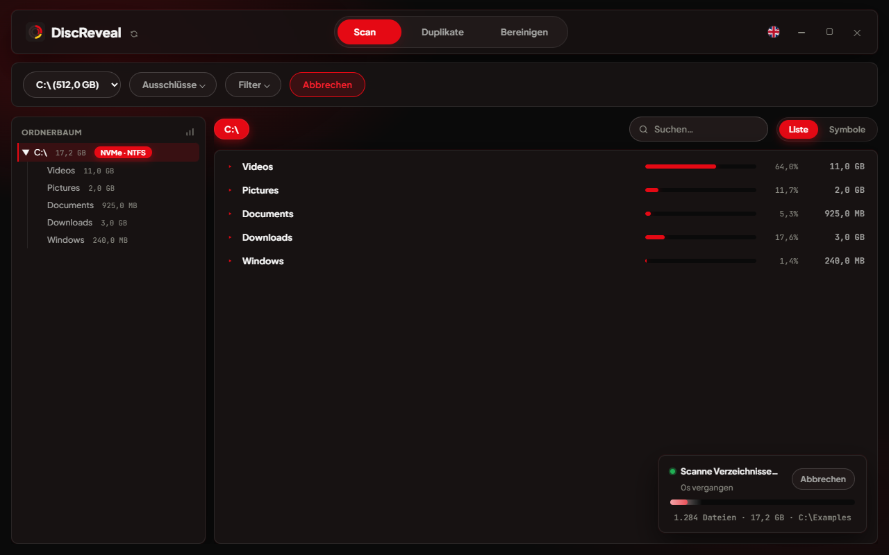
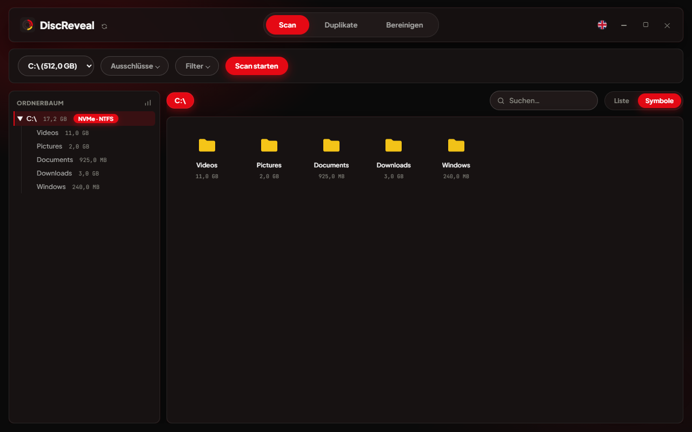
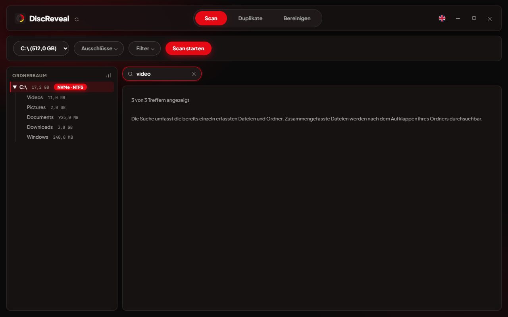
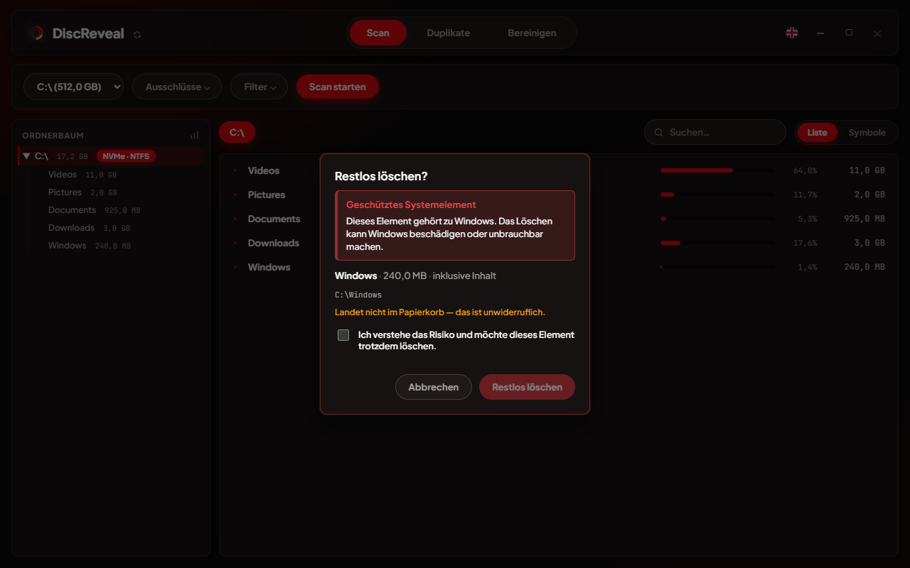
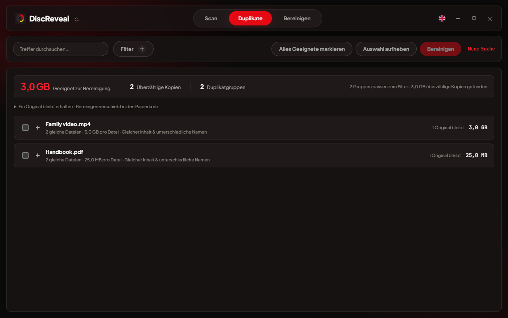
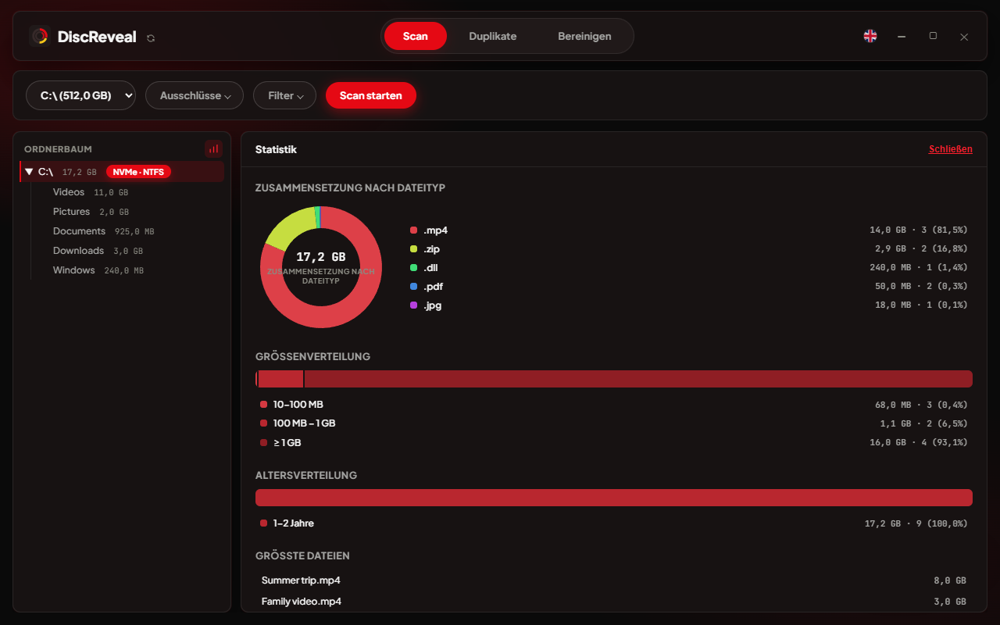
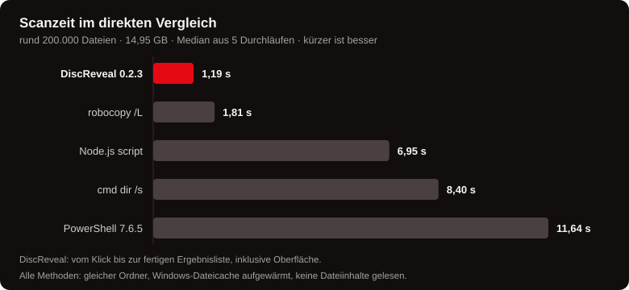

<p align="right">🇬🇧 <a href="README.md">English</a> ｜ 🇩🇪 <b>Deutsch</b></p>

<div align="center">


# DiscReveal

### [discreveal.com](https://discreveal.com/de/)

Entdecke die App, sieh sie in Aktion und lade die aktuelle Version auf der offiziellen Website herunter.

<p>
<a href="https://discreveal.com/de/"></a>
<a href="https://github.com/markmarkinson/discreveal/releases/latest/download/discreveal-portable.exe"></a>
</p>

Sieh, was auf deinem Windows-PC Platz belegt. DiscReveal zeigt Ordnergrößen schon während des Scans, findet doppelte Dateien und hilft dir beim Aufräumen.

Eine `.exe`, rund 5,2 MB. Kein Installer, kein Hintergrunddienst, keine Telemetrie.

**Kostenlos nutzbar · Quellcode öffentlich einsehbar** — sieh nach, wie DiscReveal arbeitet. [Lizenzbedingungen](LICENSE).

[Funktionen](#funktionen) · [Updates prüfen](#updates-prüfen) · [Benchmarks](#benchmarks) · [Datenschutz & Sicherheit](#sicherheit-und-datenschutz) · [Selbst bauen](#selbst-bauen)


</div>

<br>

## Warum

Im [Wissensbereich & Ratgeber](https://discreveal.com/de/ratgeber/) findest du verständliche Artikel über AppData, Cache, Prefetch, Datei-Prüfsummen und Löschen auf HDDs und SSDs. Diese Anleitungen zeigen dir das Aufräumen mit App-Aufnahmen:

- [Was belegt meine Festplatte unter Windows?](https://discreveal.com/de/ratgeber/was-belegt-meine-festplatte/)
- [Doppelte Dateien entfernen – ein Original behalten](https://discreveal.com/de/ratgeber/doppelte-dateien-entfernen/)

Im Explorer musst du die Eigenschaften eines Ordners öffnen und warten, bis seine Größe berechnet ist. DiscReveal scannt das ganze Laufwerk, zeigt die Ergebnisse laufend an und lässt dich Dateien suchen und löschen — alles in einer Oberfläche.

- Ergebnisse schon während des Scans sehen, ohne auf den Abschluss zu warten
- Portabel und sofort startklar — herunterladen, öffnen, loslegen. Ohne Installation.
- Dateien auf dem gesamten gescannten Laufwerk suchen, auch in Unterordnern
- Lokale Laufwerke, USB-Sticks und externe Festplatten scannen, mit Ordnerausschlüssen und anpassbaren Größenfiltern
- Drei Lösch-Modi: Papierkorb, endgültig, sicheres Überschreiben
- Änderungen an Dateien, auf die Windows selbst angewiesen ist, verlangen erst deine ausdrückliche Bestätigung
- Doppelte Dateien auf einem oder mehreren Laufwerken finden, mit optionalem Zwischenspeicher für schnellere Folgescans
- Temporäre Dateien und Browser-Caches analysieren, einzelne Dateien prüfen und eine bestätigte Auswahl bereinigen
- Interaktive Diagramme: Zusammensetzung nach Dateityp, Größen- und Altersverteilung, größte Dateien
- Jederzeit zwischen Deutsch und Englisch wechseln, ohne Neustart
- Offline scannen, ohne Konto und ohne Telemetrie — nach Updates suchst du nur auf Wunsch

## Funktionen

### Live-Ergebnisse

Die Ordnergrößen werden laufend aktualisiert, während Dateien gezählt werden. Ein grüner Punkt markiert Ordner, die noch gescannt werden. Du kannst die Ergebnisse bereits durchsehen; Löschen ist nach Abschluss oder Abbruch des Scans möglich. Bereits gescannte Laufwerke bleiben während der Sitzung verfügbar, sodass du ohne erneuten Scan zwischen ihnen wechseln kannst.



Der schnelle Scan zeigt Dateigrößen. Aktiviere in den Scanfiltern **Belegten Speicher messen**, um den tatsächlich belegten Dateispeicher zu ermitteln. Dieser optionale Modus berücksichtigt zusätzliche Datenströme, Komprimierung und Sparse-Dateien. Hardlinks werden in sortierter Verzeichnisreihenfolge nur einmal gezählt (Dateien vor Unterordnern); der Hinweis an der Größe zeigt auch die logische Dateigröße. Die Messung dauert länger und umfasst keine Dateisystem-Metadaten, Snapshots oder Backups. Nicht verfügbare Messungen werden als unvollständig gekennzeichnet. Nach dem Löschen von Dateien ist ein neuer Scan nötig, um die Speicherberechnung zu aktualisieren.

### Listenansicht, Symbole und Suche

In der Listenansicht siehst du Ordner und Dateien nach Größe sortiert, mit Größenbalken und Prozentangaben. Die Symbolansicht zeigt die passenden Symbole für jeden Dateityp und eignet sich zum Durchstöbern von Ordnern wie Downloads.

<table>
<tr>
<td width="50%"></td>
<td width="50%"></td>
</tr>
</table>

Die Suche berücksichtigt das gesamte gescannte Laufwerk einschließlich aller Unterordner. Die Treffer aktualisieren sich beim Tippen:



### Scan anpassen

Scanne lokale Laufwerke, USB-Sticks und externe Festplatten. Ergänze eigene Ordnerausschlüsse oder nutze die Voreinstellungen, die gängige Spielebibliotheken überspringen. Mit einer Mindest- und Höchstgröße in MB oder GB grenzt du die Ordneransicht ein. Sprache, Ansichtsmodus und Scan-Einstellungen bleiben für den nächsten Start gespeichert.

### Löschen

| Modus | Verhalten |
|---|---|
| Papierkorb | Wiederherstellbar, genau wie beim Löschen im Explorer |
| Endgültig löschen | Überspringt den Papierkorb |
| Sicher löschen | Überschreibt den Dateiinhalt vor dem Entfernen mit Zufallsdaten; Dateien mit Hardlinks werden nicht überschrieben |

Das Überschreiben erreicht die Dateiinhalte, auf die Windows zugreifen kann. Ältere SSD-Kopien, Snapshots und Backups werden damit nicht garantiert entfernt. Komprimierte, verschlüsselte und Sparse-NTFS-Dateien sowie Dateien mit zusätzlichen Datenströmen sind für sicheres Überschreiben nicht unterstützt.

Bei Windows-Inhalten, ausgewählten Systemwurzeln, Benutzerprofilwurzeln, Auslagerungsdateien und Registry-Dateien erklärt DiscReveal das Risiko. Dieser zusätzliche Schutz gilt nicht für jeden Unterordner. Erst nach einer zusätzlichen Bestätigung wird der Löschen-Button freigegeben:



### Duplikate finden

Wähle **Duplikate** im oberen Menü, wähle deine Laufwerke und starte die Suche. Weitere Einstellungen findest du unter **Suchoptionen**. Klappe eine Treffergruppe auf, um einzelne Kopien und das erhaltene Original zu prüfen. Du brauchst dafür keinen vorherigen Laufwerksscan. Beim Wechsel zwischen **Scan**, **Duplikate** und **Cleanup** bleiben laufende Arbeiten und Ergebnisse erhalten.

Finde identische Dateien auf einem oder mehreren Laufwerken — auch Kopien mit unterschiedlichen Namen. Treffer erscheinen schon während der Suche. Gleichzeitig siehst du, wie viele Gruppen und überzählige Kopien gefunden wurden und wie viel Speicherplatz sich freigeben lässt.

- **Kleine Dateien überspringen.** Dateien unter 10 MB sind standardmäßig ausgeschlossen. Schalte „Kleine Dateien ausschließen“ ab, um sie einzubeziehen, oder lege eine eigene Mindest- und Höchstgröße in MB oder GB fest.
- **Gezielt suchen.** Wähle bestimmte Dateitypen aus oder schließe sie von der Suche aus.
- **Treffer direkt filtern.** Grenze die Ergebnisse nach Name oder Pfad, Größe, Dateiendung und gleichen oder unterschiedlichen Dateinamen ein.
- **Nachvollziehbare Treffer.** Die Details zeigen Dateigröße, Stichprobenhash und den bestätigten Vergleich des vollständigen Inhalts. Ein gleicher Name oder Hash allein reicht nicht aus.
- **Ein Original behalten.** „Alles Geeignete markieren“ wählt Kopien persönlicher Dokumente und Medien aus. In jeder Gruppe bleibt ein Original erhalten. Programm- und Systemdateien werden nicht automatisch markiert.
- **Vor dem Bereinigen prüfen.** „Bereinigen“ zeigt Anzahl und Größe deiner Auswahl. Vor dem Verschieben in den Papierkorb wird jede Kopie erneut vollständig mit dem Original verglichen. Veränderte oder fehlende Dateien sowie Dateien mit Hardlinks werden übersprungen. Speicherplatz wird nach dem Leeren des Papierkorbs frei. Auch beim einzelnen Löschen bleibt ein Original erhalten und wird der Inhalt erneut geprüft.
- **Realistische Speicherersparnis.** Das Potenzial basiert auf gemessenem belegtem Speicher. Kopien mit weiteren Hardlinks tragen keinen freigebbaren Speicher bei; nicht verfügbare Messungen werden aus der Summe ausgeschlossen und im Ergebnis kenntlich gemacht.
- **Abbrechen, ohne Treffer zu verlieren.** Bereits bestätigte Duplikate bleiben erhalten. Große Ergebnislisten werden schrittweise angezeigt; weitere Treffer kannst du bei Bedarf nachladen.

Ein optionaler lokaler Zwischenspeicher beschleunigt spätere Suchen, indem er Stichprobenhashes unveränderter Dateien wiederverwendet. Er ist standardmäßig ausgeschaltet, wird nur mit deiner Zustimmung aktiviert und lässt sich jederzeit leeren.



Kleine Dateien werden vor dem Hashen und Zwischenspeichern ausgeschlossen. Die Ordner auf den ausgewählten Laufwerken werden trotzdem durchlaufen. Wie viel Zeit das spart, hängt deshalb von den vorhandenen Dateien ab. Beim Abbrechen muss die App gegebenenfalls noch auf einen bereits laufenden Windows-Dateizugriff warten.

### System bereinigen

Wähle **Cleanup → Alles prüfen**. DiscReveal prüft alle unterstützten Bereiche in einem Durchgang: ältere temporäre Dateien, Browser- und App-Caches, Spiel- und Grafik-Caches, Paket-Caches, Fehlerberichte, Windows-Systemreste und den Papierkorb. Die Ergebnisse sind in wenige große Bereiche gegliedert und vorausgewählt. Wähle ab, was du behalten möchtest, und klicke auf **Bereinigen**. Ein aufklappbarer Bereich erklärt die enthaltenen Unterpunkte; zusätzliche Filter und Einzelhaken sind nicht nötig.

Unterstützt werden unter anderem Chrome, Edge, Firefox, Brave, Opera/GX, Vivaldi, Discord, VS Code, Teams, Adobe Acrobat, pip, npm, NuGet, DirectX, NVIDIA und AMD an ihren üblichen Speicherorten. Individuell konfigurierte Cache-Verzeichnisse und beliebige Projektordner werden nicht durchsucht. Browser- und App-Caches werden meist ab einem Tag berücksichtigt, temporäre Dateien frühestens nach sieben Tagen, Fehlerberichte und Spezial-Caches nach mindestens 30 Tagen. Diese Schutzgrenzen bleiben automatisch aktiv. Entfernte Caches werden bei Bedarf neu geladen oder aufgebaut; der nächste Start kann länger dauern.

Windows prüft verfügbare Installations- und Upgrade-Reste, Übermittlungsdateien und Vorschaubilder auf seinem Systemlaufwerk. Geschützte Bereiche benötigen Administratorrechte; dafür gibt es einen ausdrücklichen Neustart, anschließend prüfst du erneut. **Frühere Windows-Versionen** fasst alte Update-Komponenten und vorherige Installationen als eigenen abwählbaren Bereich zusammen. Ihre Entfernung verlangt eine zusätzliche Bestätigung, weil betroffene Updates danach möglicherweise nicht mehr deinstalliert werden können und die Rückkehr zur früheren Windows-Version entfällt.

Vor dem Löschen zeigt eine gemeinsame Bestätigung die ausgewählten Bereiche. Cleanup entfernt diese **endgültig ohne Papierkorb**. Ist **Papierkorb** ausgewählt, werden die angezeigten lokalen Laufwerke vollständig geleert, einschließlich dort seit der Prüfung hinzugekommener Dateien. Persönliche Dokumentordner, Einstellungen, Anmeldungen und Verlauf gehören nicht zu den Bereinigungsregeln. Geöffnete Apps, geänderte, verknüpfte und geschützte Dateien werden ausgelassen. Abbrüche stoppen weitere Schritte; nach einem Fehler in der Windows-Bereinigung wird der Papierkorb nicht mehr geleert. Ergebnisse unterscheiden Schätzwerte von der beobachteten Änderung des freien Speichers. Die Analyse bleibt im Arbeitsspeicher.


### Statistik

Das Diagrammsymbol neben dem Ordnerbaum öffnet die Statistik: Speicherbelegung nach Dateityp, Verteilung nach Größe und Alter sowie eine Liste der größten Dateien. Fahre mit der Maus über die Diagramme, um Details zu sehen. Ein Klick auf eine der größten Dateien führt zu ihrem Ordner.



### Deutsch und Englisch

Menüs, Dialoge und Fehlermeldungen sind auf Deutsch und Englisch verfügbar — auch die Meldung bei fehlendem WebView2. Die Sprache lässt sich jederzeit wechseln, ohne die App neu zu starten:


### Updates prüfen

Klicke in DiscReveal auf das **Update-Symbol neben dem Appnamen**. Die Prüfung öffnet sich auf [discreveal.com](https://discreveal.com/de/) in deinem Browser.

Die Seite zeigt, ob eine neue Version verfügbar ist, und vergleicht deine App mit dem offiziellen Download. Unterschiede werden farbig markiert. Du musst keine Zahlen kopieren oder selbst vergleichen.

Für die Prüfung enthält der Link deine App-Version, die Sprache und, sofern verfügbar, einen digitalen Fingerabdruck der Programmdatei (SHA-256). Deine gescannten Dateien und ihre Pfade werden nicht mitgegeben. Ältere oder selbst erstellte Versionen können vom aktuellen Download abweichen — das bedeutet nicht automatisch, dass etwas nicht stimmt.

Du entscheidest, ob du eine neue Version herunterlädst. Die App aktualisiert sich nicht von selbst. [So funktioniert es auf der Website](https://discreveal.com/de/ratgeber/discreveal-version-pruefen/).

## Benchmarks

[Vergleichstests auf der Website ansehen](https://discreveal.com/de/benchmarks/): Ergebnisse für Laufwerksscan und Duplikatsuche, Testaufbau und Rohdaten.



**Rund 200.000 Dateien, 14,95 GB, derselbe Ordner für alle Methoden.** Die fertige DiscReveal-App zeigt die abschließenden Ergebnisse nach **1,19 Sekunden** — inklusive Scan, Datenübertragung und Darstellung. Das ist in diesem Test rund **1,5× schneller als robocopy**, **7,1× schneller als `dir /s`** und **9,8× schneller als PowerShell**.

| Methode | Zeit (Median) |
|---|---:|
| **DiscReveal** | 1,19 s |
| robocopy /L | 1,81 s |
| Node.js script | 6,95 s |
| cmd dir /s | 8,40 s |
| PowerShell 7.6.5 | 11,64 s |

Intel Core i7-6700K, Samsung 860 EVO SATA-SSD, aufgewärmter Windows-Dateicache, Median aus je fünf Durchläufen. DiscReveal: veröffentlichte Windows-App, bereits geöffnet in der Listenansicht, gemessen vom echten Klick bis zur vollständig dargestellten Ergebnisliste. Befehle: vom Prozessstart bis zum Abschluss, ohne Dateilisten auf dem Bildschirm auszugeben. Die tatsächliche Zeit hängt von deinem Laufwerk und deinen Dateien ab.

Die Werte gelten für den Laufwerksscan, nicht die Duplikatsuche. [Messwerte und Testaufbau](docs/benchmarks/scan-0.2.3.json).

### Duplikatsuche

DiscReveal sortiert unterschiedliche Dateien früher aus und vermeidet unnötiges erneutes Lesen. Gleiche Inhalte werden weiterhin vollständig geprüft. Beim Bereinigen bleibt ein Original erhalten.

- **Gezielter prüfen:** Kleine Ausschnitte an mehreren Stellen helfen, unterschiedliche Dateien schnell auszusortieren — auch wenn sie gleich anfangen.
- **Weniger doppelt lesen:** Bei vielen Kopien nutzt DiscReveal bereits gelesene Inhalte. Die Zahl paralleler Prüfungen passt sich deinem Laufwerk an.
- **Genauer zählen:** Mehrere Verknüpfungen auf dieselbe Datei zählen nicht als zusätzlicher Speicherplatz. Treffer und Kopien aktualisieren sich während der Prüfung.

In drei von vier gezielten Tests ist unser Suchkern schneller als Czkawka 12.0.2. Im besonders schwierigen vierten Fall liegt Czkawka vorn. Beide finden genau die erwarteten Duplikate.

**Suchkern / Kommandozeile · ohne grafische Oberfläche · warmer Windows-Dateicache.**

| Testfall | DiscReveal | Czkawka 12.0.2 |
|---|---:|---:|
| Gleicher Anfang, anderer Inhalt | 71 ms | 193 ms |
| Unterschiede außerhalb der Stichproben | 392 ms | 354 ms |
| Viele identische Kopien | 77 ms | 192 ms |
| Kleine Dateien ausgeschlossen | 15 ms | 88 ms |

Intel Core i7-6700K, SATA-HDD, fünf Durchläufe je Programm nach einem Aufwärmlauf, Median. Gemessen wurde die Zeit vom Prozessstart bis zum fertigen Ergebnisexport. Beide App-Caches waren aus; der Windows-Dateicache war bereits gefüllt. DiscReveal wurde als isolierter Suchkern mit vollständigem Bytevergleich gemessen, Czkawka 12.0.2 als Kommandozeilenprogramm mit BLAKE3 und Standard-Threadzahl. Die Oberfläche war bei beiden nicht enthalten.

Die Testdateien wurden bewusst für unterschiedliche Prüffälle erstellt. Das sind keine typischen persönlichen Dokumente. Die Werte hängen von Dateien, Laufwerk und Cache ab und versprechen keine allgemeine Beschleunigung. Bei kaltem Dateicache oder in der vollständigen App können andere Zeiten entstehen.

[Alle Messwerte und der genaue Testaufbau](https://discreveal.com/benchmarks/duplicates-0.2.5.json).

## Sicherheit und Datenschutz

- **Dateiaktionen bleiben im Scanbereich.** Öffnen und Löschen sind auf die Laufwerke oder Ordner des jeweiligen Ergebnisses beschränkt. Der Ausgangsordner eines Scans lässt sich nicht löschen.
- **Zusätzliche Bestätigung bei geschützten Pfaden.** Windows-Inhalte und ausgewählte Systemwurzel- und Profilpfade verlangen eine weitere Bestätigung vor dem Löschen.
- **Kein versehentliches Ausführen.** Ausführbare Dateien, Skripte und Verknüpfungen werden nie per Doppelklick gestartet; DiscReveal zeigt sie stattdessen im Explorer.
- **Lokale Analyse.** DiscReveal untersucht deine Dateien auf deinem Computer, ohne Konto und ohne Telemetrie. Die Oberfläche blockiert externe Netzwerkanfragen. Nur wenn du die Update-Prüfung anklickst, öffnet sich eine Website in deinem Browser.
- **Scanergebnisse bleiben im Arbeitsspeicher.** Bereits gescannte Laufwerke kannst du während derselben Sitzung wieder öffnen, ohne erneut zu scannen. Beim Schließen der App werden die Ergebnisse verworfen.
- **Zwischenspeicher nur auf Wunsch.** Mit deiner Zustimmung speichert die Duplikatsuche Dateipfade, Größen, Änderungszeiten und Stichprobenhashes unter `%LOCALAPPDATA%\DiscReveal\Cache`. Die Größenanzeige berücksichtigt alle Cache-Dateien. Du kannst den Zwischenspeicher direkt in der App leeren.
- **Einstellungen mitnehmen.** Deine Einstellungen liegen im Ordner `discreveal_data` neben der exe. Kopiere ihn zusammen mit der App, wenn du sie mitnehmen möchtest. WebView2 legt außerdem ein lokales Profil für die Oberfläche im Windows-AppData-Ordner an.
- **Geprüfte Funktionen.** Automatisierte Rust- und JavaScript-Tests prüfen Pfade, Scans, Dateiaktionen, Bereinigung, Oberfläche und Website.

## Download

Lade die neueste `discreveal-portable.exe` aus dem [offiziellen Download](https://github.com/markmarkinson/discreveal/releases/latest/download/discreveal-portable.exe) herunter. Für Windows 10 oder 11, 64-Bit. Keine Installation nötig. Die Microsoft-Edge-WebView2-Laufzeitumgebung muss vorhanden sein; falls sie fehlt, bietet DiscReveal einen Link zur Installation an.

Das Release bietet die Urheberrechts- und Lizenzhinweise zusätzlich als separate Datei [THIRD-PARTY-LICENSES.html](https://github.com/markmarkinson/discreveal/releases/latest/download/THIRD-PARTY-LICENSES.html) an.

Jedes Release listet einen SHA-256-Hash für die exe. So prüfst du deinen Download dagegen:

```powershell
Get-FileHash discreveal-portable.exe -Algorithm SHA256
```

## Selbst bauen

Zum Bauen unter Windows brauchst du Node.js, Rust, die Microsoft C++ Build Tools und WebView2. Für Release-Builds wird außerdem `cargo-about` benötigt (`cargo install cargo-about --features cli`). Danach:

```powershell
npm ci
npm run tauri:dev        # Entwicklungs-Build
npm run dist:portable    # Release-Build -> dist/discreveal-portable.exe
npm test                # Tests für Oberfläche und Update-Seite
cd src-tauri
cargo test              # 114 Rust-Tests
```

Tauri v2, Rust-Backend, reines JavaScript-Frontend — ohne Frontend-Framework oder Bundler. [Drittanbieter-Hinweise und Lizenztexte](https://discreveal.com/de/third-party-notices/) findest du auf der Website. Nach Änderungen an der Website erzeugt `npm run site:build` die Seiten neu.

## Lizenz

**Kostenlos nutzbar, Quellcode öffentlich einsehbar.** Die [DiscReveal Source-Available License 1.0](LICENSE) erlaubt die Nutzung der unveränderten App privat und intern im Unternehmen sowie das Einsehen des Codes. Änderungen und kommerzieller Weitervertrieb benötigen die schriftliche Erlaubnis von markMarkinson. Unveränderte offizielle Releases dürfen mit den erforderlichen Lizenzhinweisen kostenlos und nicht kommerziell weitergegeben werden.

Die Bedingungen gelten für Veröffentlichungen mit dieser Lizenz. Bereits gewährte GPL-Rechte an früheren Veröffentlichungen und dem daraus übernommenen Code bleiben bestehen. Drittanbieter-Komponenten behalten ihre eigenen Lizenzen.
