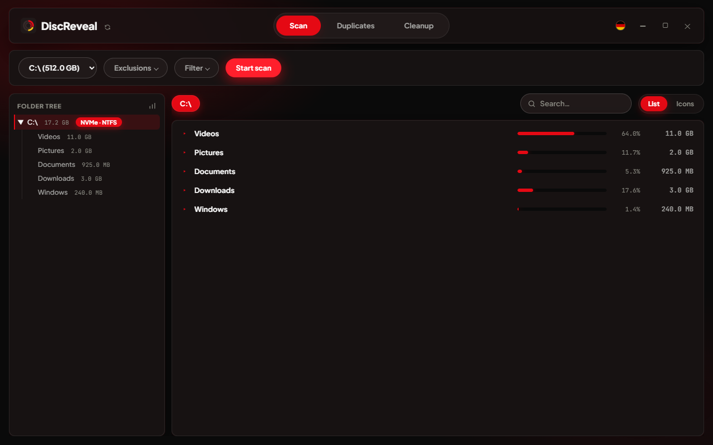
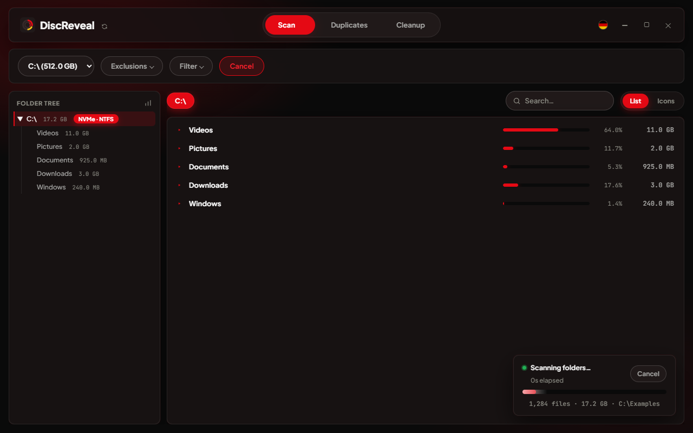
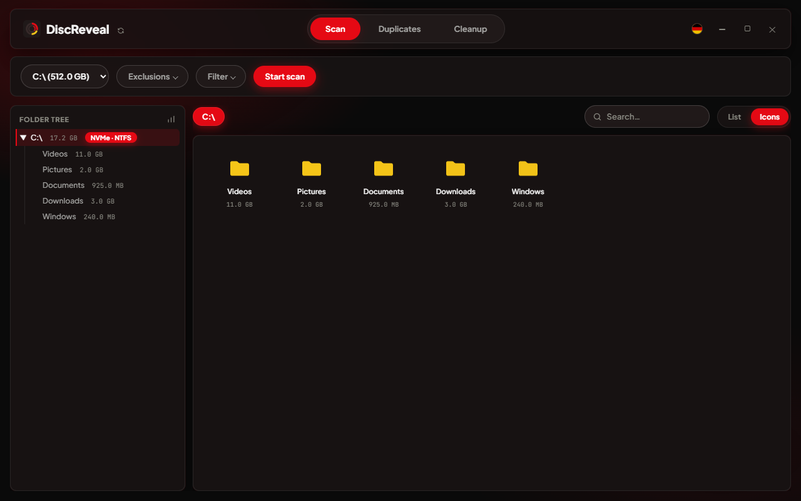
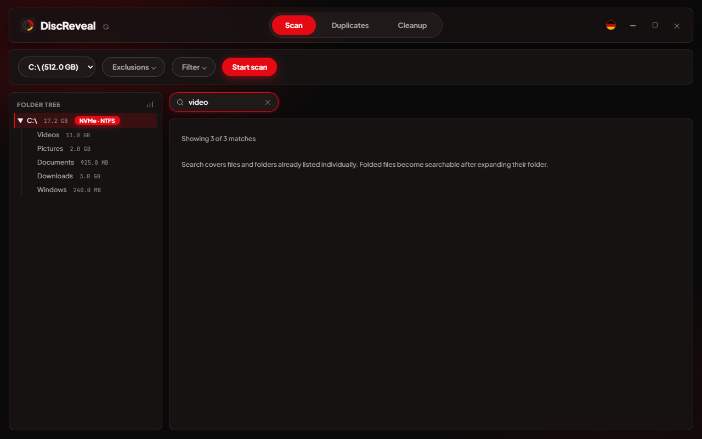
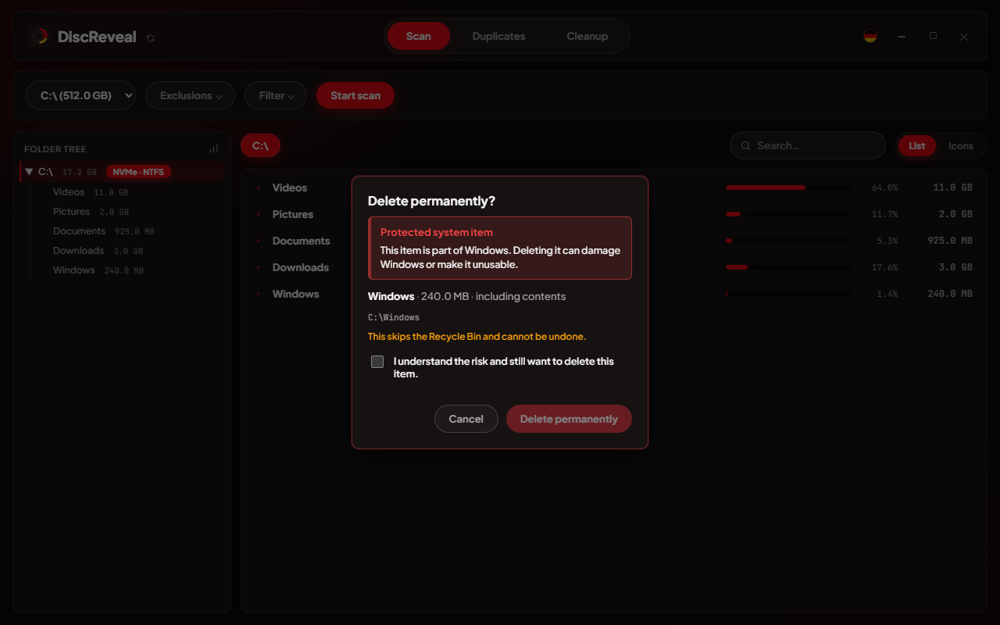
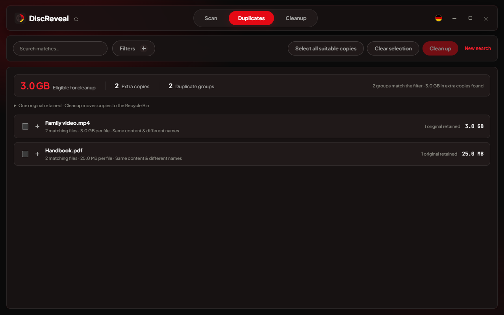
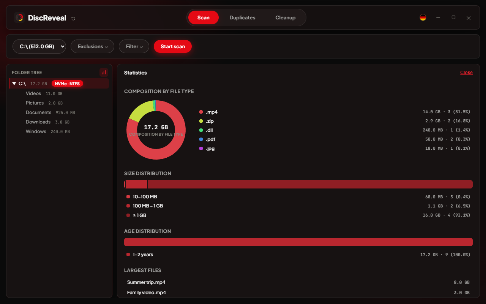
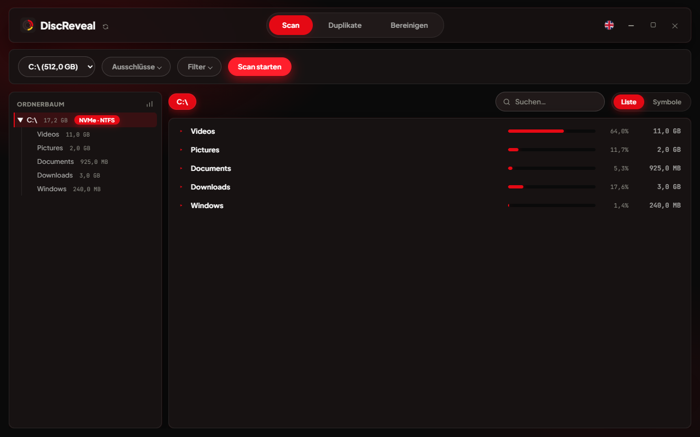
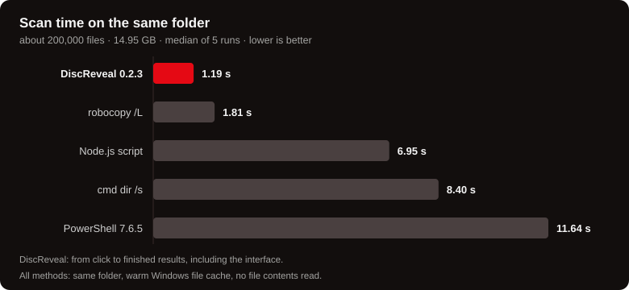

<p align="right">🇬🇧 <b>English</b> ｜ 🇩🇪 <a href="README.de.md">Deutsch</a></p>

<div align="center">


# DiscReveal

### [discreveal.com](https://discreveal.com/)

Explore the app, see it in action and get the latest version on the official website.

<p>
<a href="https://discreveal.com/"></a>
<a href="https://github.com/markmarkinson/discreveal/releases/latest/download/discreveal-portable.exe"></a>
</p>

See what's taking up space on your Windows PC. DiscReveal shows folder sizes as it scans, finds duplicate files and helps you choose what to remove.

Single `.exe`, about 5.2 MB. No installer, no background service, no telemetry.

**Free to use · Source code publicly available** — inspect how DiscReveal works. [License terms](LICENSE).

[Features](#features) · [Check for updates](#check-for-updates) · [Benchmarks](#benchmarks) · [Privacy & safety](#security-and-privacy) · [Build from source](#build-from-source)



</div>

<br>

## Why

Explore the [knowledge & guides section](https://discreveal.com/guides/): clear explanations of AppData, cache, Prefetch, file checksums and deletion on HDDs and SSDs. Start with these illustrated cleanup guides:

- [What is taking up space on my Windows drive?](https://discreveal.com/guides/what-is-taking-up-disk-space/)
- [Remove duplicate files while keeping an original](https://discreveal.com/guides/remove-duplicate-files/)

File Explorer only tells you a folder's size after you click into it and wait on a properties dialog. DiscReveal scans the whole drive in the background, lists results while it's still scanning, and lets you search and delete without switching tools.

- See results while the scan runs, without waiting for it to finish
- Portable and ready to use — no installation, just download and launch
- Search across the entire scanned tree, not just the current folder
- Scan local drives, including USB and external drives, with folder exclusions and adjustable size filters
- Three delete modes: Recycle Bin, permanent, secure overwrite
- Explicit confirmation before touching anything Windows itself depends on
- Find duplicate files across one or several drives, with an optional persistent hash cache for faster repeat scans
- Analyze temporary files, browser and app caches and Windows leftovers; review broad areas and confirm the cleanup
- Interactive charts: composition by file type, size and age distribution, largest files
- German and English, switchable at runtime
- Scan offline, without an account or telemetry — check for updates only when you choose to

## Features

### Live results

Folder sizes update as files are counted. A green dot marks folders still being scanned. You can browse the results while the scan runs; deletion becomes available when it finishes or you stop it. Completed scans stay available during the session, so switching back to a scanned drive is instant.



The fast scan shows file sizes. For occupied space, enable **Measure occupied space** in the scan filters. This optional mode measures allocated file data, including additional data streams, compression and sparse files. Hard links are counted once, in sorted directory order (files before subfolders); hover over a size to see the logical file size. It takes longer and excludes filesystem metadata, snapshots and backups. Unavailable measurements are marked incomplete. After deleting files, scan again to update occupied-space accounting.

### List and grid, tree-wide search

List view sorts by size with a bar, percentage and exact size per row — the view you want when deciding what to delete. Grid view shows real per-file-type icons — the view you want when browsing something like a Downloads folder.

<table>
<tr>
<td width="50%"></td>
<td width="50%"></td>
</tr>
</table>

Search matches anywhere in the scanned tree, not just the current folder, and updates as you type:



### Choose what to scan

Scan local drives, USB sticks and external drives. Add folders to the exclusion list or use the defaults, which skip common game-library folders. Minimum and maximum size filters let you focus the folder view, with values entered in MB or GB. Your language, view mode and scan preferences are remembered for next time.

### Deletion

| Mode | Behavior |
|---|---|
| Recycle Bin | Recoverable, same as deleting in Explorer |
| Delete permanently | Skips the Recycle Bin |
| Secure delete | Overwrites file contents with random data before removal; refuses hard-linked files |

Secure delete operates on the file contents Windows can access. It cannot guarantee erasure of older SSD copies, snapshots or backups. Compressed, encrypted and sparse NTFS files and files with additional data streams are not supported for secure overwrite.

Windows contents, selected system root folders, user-profile roots, paging files and registry hives require an additional acknowledgement explaining the risk. This does not extend to every subfolder:



### Duplicate finder

Choose **Duplicates** in the top menu, select your drives and start searching. Extra settings sit under **Search options**. Open a matching group to review individual copies and the retained original. You can use it without scanning a drive first. Switching between **Scan**, **Duplicates** and **Cleanup** preserves ongoing work and results.

Find identical files across one or several drives, including copies with different names. Matches appear while the search runs, alongside the number of groups, extra copies and space you could reclaim.

- **Focus on larger files.** Files under 10 MB are excluded by default. Turn off “Exclude small files” to include them, or set your own minimum and maximum size in MB or GB.
- **Choose what to scan.** Include specific file types or exclude ones you do not need.
- **Filter live results.** Narrow matches by name or path, size, file extension, or whether identical files share the same name.
- **See why files match.** Details show file sizes, a sample hash and confirmation that the full contents were compared. A matching name or hash alone is never enough.
- **Realistic savings.** Potential savings use measured allocated space. Copies with further hard links contribute no reclaimable space; unavailable measurements are excluded from the total and identified in the results. Space becomes available after emptying the Recycle Bin.
- **Keep one original.** “Select all suitable copies” selects personal documents and media while keeping one original in each group. Program and system files are excluded from these bulk suggestions.
- **Review before cleanup.** “Clean up” shows the selected count and size, then moves copies to the Recycle Bin after another full comparison with the retained original. Changed or missing files and hard-linked files are skipped. Space is freed when you empty the Recycle Bin. Individual deletions also retain an original and recheck the contents.
- **Keep matches when cancelling.** Stop a search without losing the duplicates already confirmed. Large result lists load in batches, with more available on demand.

An optional local cache makes repeat searches faster by reusing sample hashes for unchanged files. It is off by default, requires your consent and can be cleared at any time.



Small files are filtered out before hashing or caching. The scanner still visits the folders on the selected drives, so the speed improvement depends on what they contain. Cancellation stops new work but may need to wait for a Windows file read already in progress.

### System cleanup

Choose **Cleanup → Check everything**. DiscReveal checks all supported areas in one pass: older temporary files, browser and app caches, game and graphics caches, package caches, error reports, Windows system leftovers and the Recycle Bin. Results are grouped into a few broad areas and preselected. Deselect anything you want to keep, then click **Clean up**. Expand an area to read about its contents; there are no extra filters or individual checkboxes to configure.

Supported standard locations include Chrome, Edge, Firefox, Brave, Opera/GX, Vivaldi, Discord, VS Code, Teams, Adobe Acrobat, pip, npm, NuGet, DirectX, NVIDIA and AMD. Custom cache locations and arbitrary project folders are not scanned. Browser and app caches are usually considered after one day, temporary files after at least seven days, and error reports and specialist caches after at least 30 days. These safeguards apply automatically. Removed caches are downloaded or rebuilt when needed, so the next launch may take longer.

Windows checks available setup and upgrade leftovers, delivery files and thumbnails on its system drive. Protected areas need administrator rights; DiscReveal offers an explicit restart, followed by a fresh check. **Previous Windows versions** groups older update components and previous installations into a separate area you can deselect. Removing them requires an additional acknowledgement because it may prevent uninstalling affected updates or going back to the previous Windows version.

One confirmation lists the selected areas before anything is removed. Cleanup **permanently removes** that selection without using the Recycle Bin. If **Recycle Bin** is selected, it is emptied completely on the listed local drives, including files added since the check. Personal document folders, settings, sign-ins and browsing history are outside the cleanup rules. Running apps and changed, linked or protected files are skipped. Cancellation stops subsequent steps; if Windows cleanup fails, the Recycle Bin is left alone. Results distinguish estimates from the observed change in free space. Analysis stays in memory.


### Statistics

The chart icon next to the folder tree opens a breakdown of storage by file type, size and age, plus a list of the largest files. Hover over the charts for details, or click an entry in the largest-files list to open its folder in the results.



### German and English

Every string — menus, dialogs, error messages, even the native "WebView2 is missing" message box — exists in both languages. Switching re-renders the interface immediately, no restart:



### Check for updates

Click the **update icon next to the app name** in DiscReveal. It opens a check on [discreveal.com](https://discreveal.com/) in your browser.

The page tells you whether a newer version is available and compares your app with the official download. Any differences are highlighted in color. You do not need to copy codes or compare them yourself.

For the check, the link includes your app version, language and, when available, a digital fingerprint of the program file (SHA-256). Your scanned files and their paths are not included. Older versions and copies you built yourself may differ from the current download; that does not automatically mean something is wrong.

You decide whether to download a new version. The app never updates itself automatically. [See how it works on the website](https://discreveal.com/guides/check-discreveal-version/).

## Benchmarks

[View the comparison tests on the website](https://discreveal.com/benchmarks/) for drive-scan and duplicate-search results, methods and raw data.



**Around 200,000 files, 14.95 GB, the same folder for every method.** The complete DiscReveal app displays the final results in **1.19 seconds** — including scanning, data transfer and rendering. In this test, that is about **1.5× faster than robocopy**, **7.1× faster than `dir /s`** and **9.8× faster than PowerShell**.

| Method | Time (median) |
|---|---:|
| **DiscReveal** | 1.19 s |
| robocopy /L | 1.81 s |
| Node.js script | 6.95 s |
| cmd dir /s | 8.40 s |
| PowerShell 7.6.5 | 11.64 s |

Intel Core i7-6700K, Samsung 860 EVO SATA SSD, warm Windows file cache, median of five runs per method. DiscReveal: the published Windows app, already open in list view, measured from a real click to the fully displayed final results. Commands: process start to completion, without printing file lists to the screen. Actual times depend on your drive and files.

These figures cover the drive scan, not the duplicate finder. [Measurements and test setup](docs/benchmarks/scan-0.2.3.json).

### Duplicate search

DiscReveal rules out different files earlier and avoids unnecessary rereading. Matching content is still checked in full. Cleanup always retains an original.

- **Check smarter:** Small samples from several parts of a file help rule out different content quickly — even when files share the same beginning.
- **Read less twice:** For groups with many copies, DiscReveal reuses content already read. The number of parallel checks adapts to your drive.
- **Count more accurately:** Multiple links to the same physical file do not count as extra reclaimable space. Matches and copy counts update during the search.

Our search core is faster than Czkawka 12.0.2 in three of four targeted tests. Czkawka leads in the particularly difficult fourth case. Both find exactly the expected duplicates.

**Search core / command line · no graphical interfaces · warm Windows file cache.**

| Test case | DiscReveal | Czkawka 12.0.2 |
|---|---:|---:|
| Same beginning, different content | 71 ms | 193 ms |
| Differences outside the samples | 392 ms | 354 ms |
| Many identical copies | 77 ms | 192 ms |
| Small files excluded | 15 ms | 88 ms |

Intel Core i7-6700K, SATA HDD, five runs per program after a warm-up, median. Time was measured from process start to completed result export. Both app caches were disabled; the Windows file cache was already warm. DiscReveal was measured as an isolated search core with full byte comparison; Czkawka 12.0.2 as its command-line program with BLAKE3 and the default thread count. Neither graphical interface was included.

The test files were deliberately created for different checking scenarios. They are not a typical collection of personal documents. Results depend on files, drive and cache and do not promise a general speedup. Cold-cache runs or the complete app may take different amounts of time.

[All measurements and the full test setup](https://discreveal.com/benchmarks/duplicates-0.2.5.json).

## Security and privacy

- **Actions stay within the scan.** Opening and deleting are checked against the drives or folders belonging to that result. Deleting a scan's root folder is blocked.
- **Extra confirmation for protected paths.** Windows contents and selected system root and profile paths require an additional acknowledgement before deletion.
- **No accidental execution.** Executables, scripts and shortcuts are never launched on double-click; DiscReveal reveals them in Explorer instead.
- **Local scanning.** Your files are scanned locally, without an account or telemetry. The interface blocks external network requests. Checking for updates opens a website in your browser only when you click the button.
- **Scan results stay in memory.** Completed drive scans remain available during the session, so you can switch back without rescanning. They are discarded when you close the app.
- **Optional cache.** With your consent, the duplicate finder stores file paths, sizes, modification times and sample hashes in `%LOCALAPPDATA%\DiscReveal\Cache`. The size display includes all cache files. You can clear it from the app.
- **Portable settings.** Your preferences are saved in `discreveal_data` beside the exe. Keep that folder with the app to take them along. WebView2 also maintains a local interface profile in Windows AppData.
- **Checks in Rust.** Automated Rust and JavaScript tests cover path validation, scanning, file actions, cleanup, the interface and the website.

## Download

Download the latest `discreveal-portable.exe` from the [official download](https://github.com/markmarkinson/discreveal/releases/latest/download/discreveal-portable.exe). For Windows 10 or 11, 64-bit. No installation needed. Microsoft Edge WebView2 is required; if it is missing, DiscReveal offers a link to install it.

The release provides a separate [THIRD-PARTY-LICENSES.html](https://github.com/markmarkinson/discreveal/releases/latest/download/THIRD-PARTY-LICENSES.html) download with the bundled components’ copyright and license texts.

Each release lists a SHA-256 hash for its exe. To check your download against it:

```powershell
Get-FileHash discreveal-portable.exe -Algorithm SHA256
```

## Build from source

On Windows, install Node.js, Rust, the Microsoft C++ Build Tools and WebView2. Release builds also need `cargo-about` (`cargo install cargo-about --features cli`). Then run:

```powershell
npm ci
npm run tauri:dev        # development build
npm run dist:portable    # release build -> dist/discreveal-portable.exe
npm test                # frontend and update-page tests
cd src-tauri
cargo test              # 114 Rust tests
```

Tauri v2, Rust backend, vanilla JavaScript frontend — no frontend framework or bundler. [Third-party notices and license texts](https://discreveal.com/third-party-notices/) are available on the website. Run `npm run site:build` after changing website content.

## License

**Free to use, with publicly available source code.** The [DiscReveal Source-Available License 1.0](LICENSE) permits running the unmodified app for personal and internal business use and inspecting its source. Modifications and commercial redistribution require written permission from markMarkinson. Complete, unmodified official releases may be shared free of charge for non-commercial purposes with all required license notices.

These terms apply to publications carrying this license. Previously granted GPL rights for earlier publications and code retained from them remain intact. Third-party components retain their own licenses.
